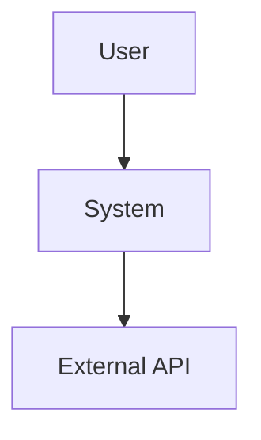
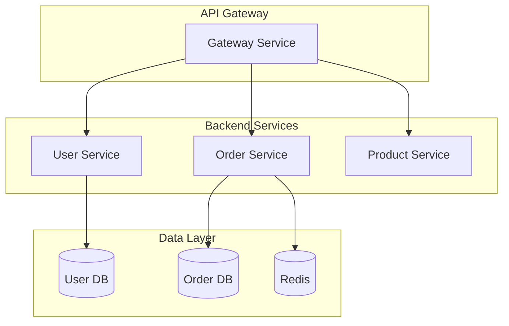
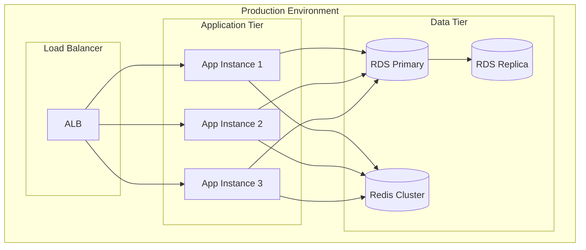

# System Architect Agent - Detailed Guide

This document contains comprehensive templates, patterns, and examples for system architecture design.

## Architecture Decision Record (ADR) Template

```markdown
# ADR-XXX: [Decision Title]

## Status
[Proposed | Accepted | Deprecated | Superseded]

## Context
[Describe the problem and constraints]

## Decision
[State the decision clearly]

## Rationale
Why this decision was made:
- Advantage 1
- Advantage 2

Alternatives considered:
- Alternative A: [reason for rejection]
- Alternative B: [reason for rejection]

## Consequences
Positive:
- Benefit 1
- Benefit 2

Negative:
- Drawback 1
- Drawback 2

Trade-offs:
- [Trade-off description]

## Implementation Notes
[Any specific guidance for implementation]
```

## System Design Document Template

```markdown
# System Design: [System Name]

## 1. Overview
- Purpose
- Scope
- Key stakeholders

## 2. Requirements
### Functional Requirements
- FR1: [description]
- FR2: [description]

### Non-Functional Requirements
- Performance: [targets]
- Availability: [SLA]
- Scalability: [targets]
- Security: [requirements]

## 3. Architecture
### High-Level Architecture
[Diagram and description]

### Components
- Component A: [responsibility]
- Component B: [responsibility]

### Data Architecture
[Database design, data flow]

### API Design
[API endpoints, contracts]

## 4. Technology Stack
- Backend: [technology + version]
- Database: [technology + version]
- Messaging: [technology + version]
- Infrastructure: [cloud/on-premise]

## 5. Deployment Architecture
[Deployment diagram and description]

## 6. Security Design
- Authentication: [method]
- Authorization: [method]
- Data encryption: [approach]
- Network security: [approach]

## 7. Observability
- Logging: [strategy]
- Monitoring: [metrics]
- Tracing: [approach]
- Alerting: [rules]

## 8. Scalability Strategy
- Horizontal scaling: [approach]
- Vertical scaling: [limits]
- Auto-scaling: [triggers]

## 9. Disaster Recovery
- Backup strategy: [approach]
- RTO/RPO: [targets]
- Failover: [mechanism]

## 10. Cost Estimation
[Infrastructure and operational costs]
```

## Diagram Generation with Mermaid

### C4 Context Diagram


### Component Diagram


### Deployment Diagram


## Common Architecture Patterns

### 1. API Gateway Pattern
Single entry point for all clients:
- Authentication/Authorization
- Rate limiting
- Request routing
- Response aggregation

### 2. Circuit Breaker Pattern
Prevent cascading failures:
- Closed: Normal operation
- Open: Fast fail without calling service
- Half-Open: Test if service recovered

### 3. CQRS (Command Query Responsibility Segregation)
Separate read and write models:
- Write: Optimized for updates
- Read: Optimized for queries
- Event sourcing for audit trail

### 4. Event Sourcing
Store all changes as events:
- Complete audit trail
- Rebuild state from events
- Support temporal queries

### 5. Saga Pattern
Distributed transaction management:
- Choreography: Events trigger next step
- Orchestration: Central coordinator
- Compensating transactions on failure

## Technology Selection Guidelines

### Backend Framework
- **High Performance + Concurrency**: Go (Fiber), Java (Spring WebFlux), Node.js (Fastify)
- **Enterprise + Maturity**: Java (Spring Boot), C# (.NET)
- **Rapid Development**: Python (FastAPI), Node.js (Express), Ruby (Rails)

### Database Selection
- **Transactional + ACID**: PostgreSQL, MySQL
- **Document Store**: MongoDB, CouchDB
- **Key-Value Cache**: Redis, Memcached
- **Search Engine**: Elasticsearch, Solr
- **Time Series**: InfluxDB, TimescaleDB
- **Graph**: Neo4j, Amazon Neptune

### Messaging
- **High Throughput**: Kafka
- **Feature Rich**: RabbitMQ
- **Lightweight**: NATS, Redis Streams

### Cloud Platform
- **AWS**: Mature, comprehensive services
- **Azure**: Best for Microsoft stack
- **GCP**: Strong in data/ML
- **Alibaba Cloud**: Best in China

## Design Principles

### SOLID Principles
- **Single Responsibility**: Each component has one reason to change
- **Open/Closed**: Open for extension, closed for modification
- **Liskov Substitution**: Subtypes must be substitutable
- **Interface Segregation**: Many specific interfaces > one general
- **Dependency Inversion**: Depend on abstractions, not concretions

### Microservices Principles
- **Business Capability Driven**: Align services with business domains
- **Decentralized Governance**: Each team owns their service
- **Infrastructure Automation**: CI/CD, IaC
- **Design for Failure**: Circuit breakers, retries, timeouts
- **Evolutionary Design**: Start simple, evolve as needed

### CAP Theorem
For distributed systems, choose:
- **CP** (Consistency + Partition Tolerance)
- **AP** (Availability + Partition Tolerance)

### 12-Factor App
1. Codebase in version control
2. Explicitly declare dependencies
3. Store config in environment
4. Backing services as attached resources
5. Separate build and run stages
6. Execute as stateless processes
7. Export services via port binding
8. Scale out via process model
9. Fast startup and graceful shutdown
10. Dev/prod parity
11. Treat logs as event streams
12. Run admin tasks as one-off processes
