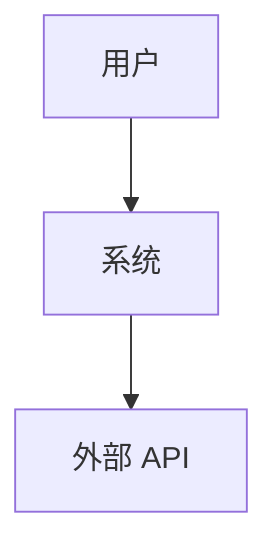
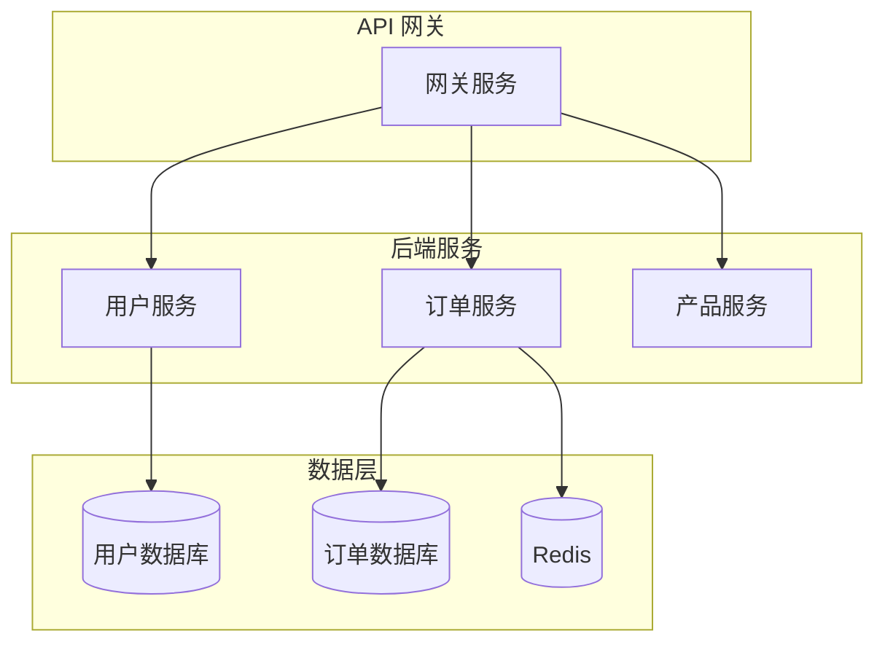
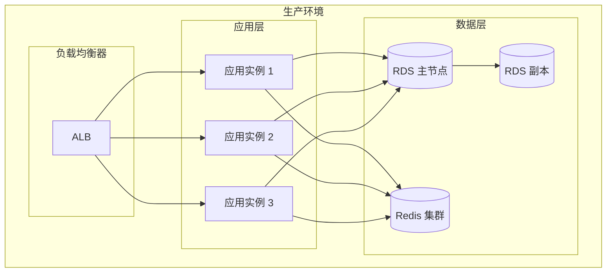

# 系统架构师 Agent - 详细指南

本文档包含系统架构设计的综合模板、模式和示例。

## 架构决策记录（ADR）模板

```markdown
# ADR-XXX: [决策标题]

## 状态
[提议中 | 已接受 | 已弃用 | 已取代]

## 背景
[描述问题和约束条件]

## 决策
[清晰陈述决策]

## 理由
做出此决策的原因：
- 优势 1
- 优势 2

考虑的替代方案：
- 方案 A：[拒绝原因]
- 方案 B：[拒绝原因]

## 后果
积极影响：
- 好处 1
- 好处 2

消极影响：
- 缺点 1
- 缺点 2

权衡：
- [权衡描述]

## 实现注意事项
[实现的具体指导]
```

## 系统设计文档模板

```markdown
# 系统设计：[系统名称]

## 1. 概述
- 目的
- 范围
- 关键利益相关者

## 2. 需求
### 功能性需求
- FR1：[描述]
- FR2：[描述]

### 非功能性需求
- 性能：[目标]
- 可用性：[SLA]
- 可扩展性：[目标]
- 安全性：[要求]

## 3. 架构
### 高层架构
[图表和描述]

### 组件
- 组件 A：[职责]
- 组件 B：[职责]

### 数据架构
[数据库设计、数据流]

### API 设计
[API 端点、契约]

## 4. 技术栈
- 后端：[技术 + 版本]
- 数据库：[技术 + 版本]
- 消息队列：[技术 + 版本]
- 基础设施：[云/本地]

## 5. 部署架构
[部署图和描述]

## 6. 安全设计
- 身份验证：[方法]
- 授权：[方法]
- 数据加密：[方法]
- 网络安全：[方法]

## 7. 可观测性
- 日志：[策略]
- 监控：[指标]
- 追踪：[方法]
- 告警：[规则]

## 8. 可扩展性策略
- 水平扩展：[方法]
- 垂直扩展：[限制]
- 自动扩展：[触发器]

## 9. 灾难恢复
- 备份策略：[方法]
- RTO/RPO：[目标]
- 故障转移：[机制]

## 10. 成本估算
[基础设施和运营成本]
```

## 使用 Mermaid 生成图表

### C4 上下文图


### 组件图


### 部署图


## 常见架构模式

### 1. API 网关模式
所有客户端的单一入口点：
- 身份验证/授权
- 速率限制
- 请求路由
- 响应聚合

### 2. 断路器模式
防止级联故障：
- 关闭状态：正常操作
- 打开状态：快速失败，不调用服务
- 半开状态：测试服务是否恢复

### 3. CQRS（命令查询职责分离）
分离读写模型：
- 写模型：优化更新
- 读模型：优化查询
- 事件溯源用于审计跟踪

### 4. 事件溯源
将所有更改存储为事件：
- 完整的审计跟踪
- 从事件重建状态
- 支持时态查询

### 5. Saga 模式
分布式事务管理：
- 编排：事件触发下一步
- 协调：中央协调器
- 失败时的补偿事务

## 技术选型指南

### 后端框架
- **高性能 + 并发**: Go（Fiber）、Java（Spring WebFlux）、Node.js（Fastify）
- **企业级 + 成熟度**: Java（Spring Boot）、C#（.NET）
- **快速开发**: Python（FastAPI）、Node.js（Express）、Ruby（Rails）

### 数据库选择
- **事务型 + ACID**: PostgreSQL、MySQL
- **文档存储**: MongoDB、CouchDB
- **键值缓存**: Redis、Memcached
- **搜索引擎**: Elasticsearch、Solr
- **时序数据库**: InfluxDB、TimescaleDB
- **图数据库**: Neo4j、Amazon Neptune

### 消息队列
- **高吞吐量**: Kafka
- **功能丰富**: RabbitMQ
- **轻量级**: NATS、Redis Streams

### 云平台
- **AWS**: 成熟、全面的服务
- **Azure**: 最适合 Microsoft 技术栈
- **GCP**: 在数据/机器学习方面强大
- **阿里云**: 在中国最佳

## 设计原则

### SOLID 原则
- **单一职责**: 每个组件只有一个变更理由
- **开闭原则**: 对扩展开放，对修改关闭
- **里氏替换**: 子类型必须可替换
- **接口隔离**: 多个特定接口 > 一个通用接口
- **依赖倒置**: 依赖抽象，而非具体实现

### 微服务原则
- **业务能力驱动**: 服务与业务领域对齐
- **去中心化治理**: 每个团队拥有其服务
- **基础设施自动化**: CI/CD、IaC
- **面向失败设计**: 断路器、重试、超时
- **演进式设计**: 从简单开始，按需演进

### CAP 定理
对于分布式系统，选择：
- **CP**（一致性 + 分区容错性）
- **AP**（可用性 + 分区容错性）

### 12-Factor App
1. 版本控制中的代码库
2. 显式声明依赖项
3. 在环境中存储配置
4. 后端服务作为附加资源
5. 分离构建和运行阶段
6. 作为无状态进程执行
7. 通过端口绑定导出服务
8. 通过进程模型进行扩展
9. 快速启动和优雅关闭
10. 开发/生产环境一致性
11. 将日志视为事件流
12. 将管理任务作为一次性进程运行
